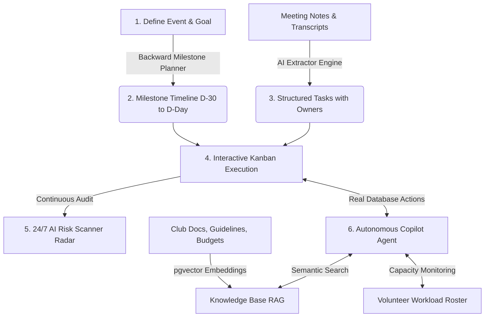

# Convene AI

<div align="center">

### 🎪 Autonomous ClubOps & Live Stage Management Platform
**Built for the ClubOps AI Hackathon Track**

[](https://nextjs.org/)
[](https://react.dev/)
[](https://www.typescriptlang.org/)
[](https://tailwindcss.com/)
[](https://aistudio.google.com/)
[](https://supabase.com/)

</div>

---

## 🎯 Problem Statement: The Reality of Campus Event Operations

Student organizations, college clubs, and campus fests face severe, recurring operational bottlenecks:

1. **Information Chaos & Lost Deliverables:** Critical decisions and tasks are scattered across unorganized WhatsApp group chats, forgotten Google Docs, and fleeting voice notes. Important action items are routinely lost in the noise.
2. **Forward Planning Trap:** Most student organizers plan "forward from today" rather than "backwards from event day." Crucial prerequisites—such as venue approvals, sponsorship agreements, AV checks, and safety clearances—are missed until it is too late to recover.
3. **Volunteer Burnout & Asymmetric Workload:** Without workload visibility, 2–3 dedicated student leads bear 90% of the burden and burn out, while dozens of enthusiastic volunteers sit idle because tasks are not clearly delegated.
4. **Late-Breaking Bottlenecks:** Organizers discover unresolved task dependencies, budget overruns, and overdue milestones 24–48 hours before the event, leading to panicked last-minute fire-fighting.
5. **Passive AI Chatbots Don't Help:** Generic AI chatbots produce walls of text or generic advice, but they cannot take action in the club's database, reassign tasks, or manage live schedules.

---

## 💡 What Convene AI Is Made For

**Convene AI** is an autonomous operational command center purpose-built for college clubs, annual fests, hackathons, and campus societies. 

Unlike traditional project management boards (Trello, Notion) that require constant manual data entry, or generic chatbots that only generate text, Convene AI pairs event management workflows with an **action-taking AI Copilot** that reads and writes directly to the club's database.

It transforms disorganized ideas, voice notes, and meeting minutes into structured timelines, assigned responsibilities, workload-balanced rosters, and proactive risk mitigations.

---

## 🛠️ How It Is Meant to Be Used (Workflow Lifecycle)

Convene AI orchestrates the entire operational lifecycle of an event through a cohesive, 6-stage workflow:



1. **Set the Target Date & Plan Backwards:** Enter your event date and concept. The AI calculates milestones backwards from D-Day (D-30, D-14, D-7, D-1), establishing necessary prerequisite dependencies (e.g. venue approvals before stage design).
2. **Turn Unstructured Chaos into Action:** After every committee meeting or voice sync, paste raw notes or transcripts into the Meeting Extractor. The AI identifies decisions, creates deliverables, sets deadlines, and auto-assigns owners by matching skills against the volunteer roster.
3. **Execute on the Kanban Board:** Team members manage tasks through a 3-column drag-and-drop board with priority tags (`low` to `critical`) and dependency links (`depends_on`).
4. **Monitor Capacity & Rebalance in 1 Click:** Leads track volunteer workload meters in real-time. If one volunteer becomes overloaded, tasks can be rebalanced immediately to available team members.
5. **Proactive Risk Detection Radar:** The system audits the event continuously, flagging overdue tasks, stalled dependencies, and volunteer bottlenecks with concrete AI-generated mitigation strategies.
6. **Command with the AI Copilot:** Organizers talk directly to the floating Copilot using natural language. The agent executes real database mutations—creating tasks, shifting deadlines, reassigning owners, and searching club guidelines via vector embeddings (RAG).

---

## ✨ Core Features & Capabilities

### 1. 🤖 Autonomous Action Copilot (Real Database Execution)
The AI Copilot does not just generate suggestions—it executes database mutations via 9 Google Gemini function-calling tools:
* `create_task` — Inserts new tasks with titles, descriptions, priorities, and deadlines.
* `assign_task` — Assigns or transfers tasks using fuzzy name matching across the volunteer roster.
* `update_task_status` — Moves tasks between `todo`, `doing`, and `done`.
* `set_deadline` — Modifies task target completion dates.
* `list_tasks` — Queries and filters tasks by status, priority level, or owner.
* `add_volunteer` — Registers new team members with designated roles and skill sets.
* `create_announcement_draft` — Drafts context-aware broadcast messages.
* `run_risk_scan` — Conducts an on-demand audit of operational vulnerabilities.
* `search_documents` — Queries uploaded event documentation using semantic vector search.

### 2. ⏳ Backward Milestone Event Planner
* Computes deliverable deadlines in reverse chronological order from the target event date.
* Automatically establishes dependency chains (e.g. *Task B cannot start until Task A is done*).
* Allocates tasks to appropriate committee roles (Logistics, Marketing, Technical, Sponsorship, Hospitality).

### 3. 📝 Meeting & Voice Transcript Action Extractor
* Ingests messy, conversational meeting minutes and voice transcriptions.
* Extracts high-level summaries, key decisions, and prioritized action items.
* Fuzzy-matches mentioned names to registered team members and assigns deadlines automatically.

### 4. 🛡️ 24/7 AI Risk Scanner & Bottleneck Radar
* Continuously scans for overdue deliverables, unassigned high-priority tasks, and bottlenecked dependencies.
* Identifies volunteers whose assigned task load exceeds healthy operating thresholds.
* Gemini provides plain-English impact assessments and actionable step-by-step mitigation plans.

### 5. 📚 Document Knowledge Base with pgvector Semantic Search (RAG)
* Upload event guidelines, university rulebooks, safety protocols, budgets, and sponsor contracts.
* Chunks and vectorizes documents using 768-dimensional embeddings (`gemini-embedding-001`).
* Enables instant, citation-backed semantic Q&A for organizers and volunteers directly in the app.

### 6. 👥 Volunteer Roster & Workload Balancing
* Real-time capacity indicators displaying the percentage workload for each volunteer.
* Categorizes members by role and specialized skill sets.
* Enables 1-click task reassignment to prevent student organizer burnout.

### 7. 📋 Dependency-Aware Kanban Board
* 3-column drag-and-drop workflow (`todo`, `doing`, `done`).
* Explicit dependency indicators (`depends_on`) preventing premature task starts.
* Color-coded priority badges (`low`, `medium`, `high`, `critical`) and deadline badges.

### 8. 📢 Context-Aware Announcement Generator
* Pulls live event deadlines, completed milestones, and volunteer requests directly from the database.
* Automatically formats text with WhatsApp-compatible bolding, bullet points, and emojis.
* Features 1-click copy-to-clipboard for rapid dispatch across committee broadcast channels.

### 9. 🎨 Modern Interactive 3D Showcase & Dark Mode
* Interactive 3D hero scene powered by Three.js and React Three Fiber.
* Seamless Dark / Light mode theme switching.
* Tabbed module previews, Bento feature grids, and Before/After comparisons.

---

## 💻 Technological Stack

| Layer | Technology | Purpose |
|---|---|---|
| **Core Framework** | **Next.js 16.3.5 (App Router)** | Modern full-stack React framework with Turbopack for rapid compilation and server-side API routes. |
| **Language & Types** | **TypeScript 5** | Strict end-to-end type safety across client interfaces, database schemas, and AI function-calling parameters. |
| **User Interface** | **React 19 & Tailwind CSS v4** | Modern reactive component architecture with high-performance utility-first styling. |
| **Animations & Icons** | **Framer Motion & Lucide React** | Fluid UI transitions, micro-interactions, modal animations, and consistent iconography. |
| **3D Graphics** | **Three.js & React Three Fiber** | Interactive 3D canvas and robot model rendering on the public showcase landing page. |
| **Database & Vector Store** | **Supabase (PostgreSQL + pgvector)** | Relational database management with pgvector extension for storing and querying 768-dim document embeddings. |
| **AI Reasoning & Tools** | **Google Gemini (`gemini-3.6-flash`)** | Core intelligence engine powering the autonomous copilot agent, backwards planning, meeting extraction, and risk scans. |
| **Lightweight AI Generation** | **Google Gemini (`gemini-3.5-flash-lite`)** | High-speed, cost-efficient model for announcement drafting and text formatting. |
| **Embeddings (RAG)** | **Google Gemini (`gemini-embedding-001`)** | Generates 768-dimensional vector representations of club documents for cosine similarity search. |

---

## 📂 Project Architecture

```
convene-ai/
├── app/
│   ├── (app)/                       # Authenticated ClubOps Workspace
│   │   ├── dashboard/               # Operational overview & AI backward planner
│   │   ├── tasks/                   # 3-column Kanban board with dependency tracking
│   │   ├── volunteers/              # Volunteer roster & workload capacity meters
│   │   ├── meetings/                # Meeting notes & action item extractor
│   │   ├── documents/               # Knowledge base & semantic vector search (RAG)
│   │   ├── announcements/           # Context-aware broadcast draft generator
│   │   └── risks/                   # 24/7 AI Risk Scanner radar
│   ├── api/                         # Backend Serverless Endpoints
│   │   ├── agent/                   # Autonomous Copilot with Gemini tool-calling
│   │   ├── plan/                    # Backward milestone generator
│   │   ├── meetings/extract/        # Meeting transcript action parser
│   │   ├── risks/scan/              # Overdue & bottleneck detector
│   │   ├── documents/               # Document chunking, embedding, & RAG query
│   │   └── announcements/           # Live context announcement generator
│   ├── signin/                      # Direct sign-in & instant trial access
│   ├── account-creation/            # Club onboarding flow
│   ├── globals.css                  # Design tokens & Tailwind utility configurations
│   ├── layout.tsx                   # Root HTML layout with ThemeProvider
│   └── page.tsx                     # 3D interactive landing page
├── components/landing/              # Hero, 3D Canvas, Bento grid, ThemeContext
├── lib/
│   ├── ai.ts                        # Gemini SDK helper with 429 exponential backoff retry
│   ├── chunking.ts                  # Document text chunker for vector embeddings
│   ├── mock-data.ts                 # Local demo dataset fallback
│   ├── supabase/                    # Supabase browser, server, & mock clients
│   └── utils.ts                     # Class merge utilities
├── supabase/
│   ├── schema.sql                   # Relational database schema with pgvector
│   ├── seed.sql                     # Seed data for campus hackathon demo
│   └── rag.sql                      # Vector search SQL function
├── CONVENE_AI_DEPLOYMENT_AND_AUTH_GUIDE.md # Production & OAuth setup guide
└── ROADMAP_FEATURES_TO_BE_ADDED.md         # Stage 2 architecture specifications
```

---


## 📄 License

MIT © [Convene AI Team](https://github.com/jeetptl1503/convene-ai)
