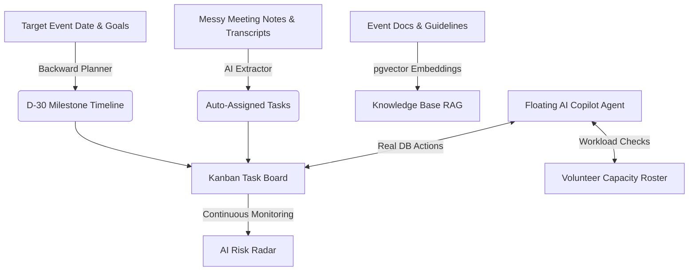

# Convene AI

<div align="center">

### 🎪 Autonomous ClubOps & Live Stage Management for Campus Events
**Built for the ClubOps AI Hackathon Track**

[](https://nextjs.org/)
[](https://react.dev/)
[](https://www.typescriptlang.org/)
[](https://tailwindcss.com/)
[](https://aistudio.google.com/)
[](https://supabase.com/)

</div>

---

## 💡 What is Convene AI?

College club events and campus fests are notorious for **operational chaos**:
* Action items get buried in 200+ unread WhatsApp messages.
* Task spreadsheets fall out of date the day they are created.
* Volunteers get overwhelmed or burnt out with uneven workloads.
* Organizers discover critical bottlenecks 24 hours before showtime.

**Convene AI transforms this chaos into an autonomous operations command center.** Rather than another passive task board or a simple chatbot, Convene AI features an **Agentic Copilot with real database tools** that can autonomously schedule milestones, match tasks to volunteer skills, parse messy meeting notes into assigned tasks, and detect operational risks before they derail your event.

---

## 🔄 How It Works (At a Glance)



1. **Plan Backwards from D-Day:** Set the event date (e.g., Annual Tech Fest). Gemini creates a milestone schedule working backwards from the deadline with automatic dependencies and role allocations.
2. **Turn Notes into Action Items:** Paste rough meeting transcripts or voice memos. The AI extracts action items, estimates deadlines, and fuzzy-matches task owners to your volunteer roster.
3. **Command via Autonomous Copilot:** Talk to the floating AI Copilot. It doesn't just give text advice—it creates tasks, reassigns owners, updates statuses, queries workloads, and searches documents.
4. **24/7 Proactive Risk Radar:** The scanner continuously monitors for overdue tasks, bottlenecks, and overloaded members, suggesting immediate mitigation steps.

---

## ⚡ 10-Second Quick Start (Instant Trial Mode)

Convene AI includes a **persistent in-memory mock database and simulated AI fallback**. You can run and explore the entire platform locally **with zero setup or API keys required**:

```bash
# 1. Install dependencies
npm install

# 2. Start the local server
npm run dev
```

👉 Open **[http://localhost:3000](http://localhost:3000)** in your browser:
* Explore the interactive **3D Robot landing page** with Dark/Light theme switching.
* Click **"Enter Dashboard"** to test the live Kanban board, backward planner, volunteer capacity tracker, risk scanner, and document RAG knowledge base.

---

## ✨ Core Features Matrix

| Feature | Powered By | The Problem It Solves | What the AI Does |
|---|:---:|---|---|
| **Autonomous Action Copilot** | `gemini-3.6-flash` | Organizers spend hours manually updating boards and assigning tasks. | Uses 9 function-calling tools to execute real database mutations directly from natural language chat. |
| **Backward Milestone Planner** | `gemini-3.6-flash` | Teams start planning too late and miss prerequisite dependencies. | Computes deadlines backwards from event day (D-30 to D-Day), creating structured tasks with dependency graphs. |
| **Meeting & Voice Extractor** | `gemini-3.6-flash` | Critical decisions made in meetings get lost in disorganized notes. | Extracts actionable deliverables, deadlines, and risks; matches owners against volunteer roster skills. |
| **24/7 AI Risk Scanner** | `gemini-3.6-flash` | Bottlenecks and volunteer burnout are discovered only after deadlines pass. | Detects overdue tasks, dependency blockers, and overloaded members; outputs actionable mitigation steps. |
| **Document Knowledge Base (RAG)** | `gemini-embedding-001` + `pgvector` | Important event rules, vendor contacts, and budget limits are scattered across PDFs. | Chunks documents into 768-dim embeddings; provides semantic similarity search with citations. |
| **Context-Aware Announcements** | `gemini-3.5-flash-lite` | Drafting updates takes time and organizers forget key upcoming deadlines. | Pulls live upcoming tasks and deadlines from the database into ready-to-copy WhatsApp-formatted broadcasts. |
| **Kanban Task Board** | Next.js + Tailwind | Traditional boards lack dependency tracking and skill context. | 3-column drag-and-drop workflow (`todo`, `doing`, `done`) with priorities (`low` to `critical`) and `depends_on` links. |
| **Volunteer Capacity Tracker** | Next.js + Supabase | Uneven task distribution leads to overworked leads and idle volunteers. | Live capacity meters (% load), skill tags, and 1-click task rebalancing. |
| **Interactive 3D Showcase** | Three.js + R3F | Standard club tools are dull and uninspiring for student organizers. | Interactive 3D robot model, Bento feature grids, Before/After comparisons, and full dark mode support. |

---

## 🤖 What Can the Copilot Agent Actually Do?

The embedded AI Copilot (`app/api/agent/route.ts`) is equipped with **real function-calling tools** that read and write directly to your database:

* `create_task(title, description, owner_name, deadline, priority)` — Adds a new task directly to the Kanban board.
* `assign_task(task_title_or_id, volunteer_name)` — Reassigns an existing task using fuzzy name matching.
* `update_task_status(task_title_or_id, status)` — Moves tasks between `todo`, `doing`, and `done`.
* `set_deadline(task_title_or_id, deadline)` — Updates completion deadlines on the fly.
* `list_tasks(status, priority, owner_name)` — Filters and queries active tasks.
* `add_volunteer(name, email, role, skills)` — Registers a new member to the event team roster.
* `create_announcement_draft(title, body)` — Drafts contextual announcements for WhatsApp/Slack.
* `run_risk_scan()` — Triggers an on-demand operational audit of overdue tasks and bottlenecks.
* `search_documents(query)` — Performs vector similarity searches across uploaded club documentation.

---

## 🛠️ Technology Stack

```
Frontend:          Next.js 16.3.5 (App Router with Turbopack)
UI & Styling:      React 19, Tailwind CSS v4, Lucide React, Framer Motion
3D Visuals:        Three.js, React Three Fiber (@react-three/fiber), @react-three/drei
Database:          Supabase (PostgreSQL with pgvector) + In-Memory Mock Fallback
AI Models:         Google Gemini via @google/genai (Automatic 429 exponential backoff)
                   ├── gemini-3.6-flash     (Agent tool-calling, planning, extraction, risks)
                   ├── gemini-3.5-flash-lite (Formatting, drafting, lightweight generation)
                   └── gemini-embedding-001 (768-dimensional vector embeddings for RAG)
```

---

## 🚀 Full Production Setup (Supabase & Gemini)

To connect your own cloud database and Gemini API keys:

### 1. Configure `.env.local`
```bash
cp .env.example .env.local
```
Add your credentials:
```env
NEXT_PUBLIC_SUPABASE_URL=https://<your-project-id>.supabase.co
NEXT_PUBLIC_SUPABASE_ANON_KEY=<your-anon-key>
SUPABASE_SERVICE_ROLE_KEY=<your-service-role-key>
GEMINI_API_KEY=<your-gemini-api-key>
```

### 2. Run Database Migrations
In your Supabase project's **SQL Editor**, execute in order:
1. `supabase/schema.sql` — Creates tables and enables the `vector` extension.
2. `supabase/seed.sql` — Loads sample demo event, 8 volunteers, and 12 tasks.
3. `supabase/rag.sql` — Installs the `match_document_chunks` vector search function.

*(For detailed step-by-step instructions on Google OAuth and Vercel deployment, read the [Deployment Guide](CONVENE_AI_DEPLOYMENT_AND_AUTH_GUIDE.md))*.

---

## 📂 Project Architecture

```
convene-ai/
├── app/
│   ├── (app)/                       # Authenticated ClubOps Workspace
│   │   ├── dashboard/               # Overview metrics & AI backward planner
│   │   ├── tasks/                   # Kanban task board with dependency tracking
│   │   ├── volunteers/              # Volunteer roster & workload capacity meters
│   │   ├── meetings/                # Meeting notes & action item extractor
│   │   ├── documents/               # Knowledge base & semantic vector search (RAG)
│   │   ├── announcements/           # Context-aware broadcast draft generator
│   │   └── risks/                   # 24/7 AI Risk Scanner radar
│   ├── api/                         # Backend Serverless Endpoints
│   │   ├── agent/                   # Autonomous Copilot with Gemini tool-calling
│   │   ├── plan/                    # Backward milestone generator
│   │   ├── meetings/extract/        # Meeting transcript action parser
│   │   ├── risks/scan/              # Overdue & bottleneck detector
│   │   ├── documents/               # Document chunking, embedding, & RAG query
│   │   └── announcements/           # Live context announcement generator
│   ├── signin/                      # Direct sign-in & instant trial access
│   ├── account-creation/            # Club onboarding flow
│   └── page.tsx                     # 3D interactive landing page
├── components/landing/              # Hero, 3D Canvas, Bento grid, ThemeContext
├── lib/
│   ├── ai.ts                        # Gemini SDK helper (with 429 backoff retry)
│   ├── chunking.ts                  # Document text chunker for vector embeddings
│   ├── mock-data.ts                 # Local demo mock dataset
│   └── supabase/                    # Supabase browser, server, & mock clients
├── supabase/                        # Database schema, seed data, & pgvector functions
├── CONVENE_AI_DEPLOYMENT_AND_AUTH_GUIDE.md # Production & OAuth setup guide
└── ROADMAP_FEATURES_TO_BE_ADDED.md         # Stage 2 architecture specifications
```

---

## 🗺️ Product Roadmap

* **Stage 1 (Current Evaluation):** Core ClubOps operations — Backward Milestone Planner, Autonomous Action Copilot, Volunteer Workload Monitoring, Meeting Extractor, Risk Radar, and pgvector RAG.
* **Stage 2 (Upcoming):** Live Stage Flow Controller (`/stage-flow`) with cascading agenda adjustments, Direct WhatsApp Voice Note ingestion pipeline, Web Push notification alerts, and direct WhatsApp Business API dispatch.
  * *See the full architectural breakdown in [ROADMAP_FEATURES_TO_BE_ADDED.md](ROADMAP_FEATURES_TO_BE_ADDED.md)*.

---

## 📄 License

MIT © [Convene AI Team](https://github.com/jeetptl1503/convene-ai)
