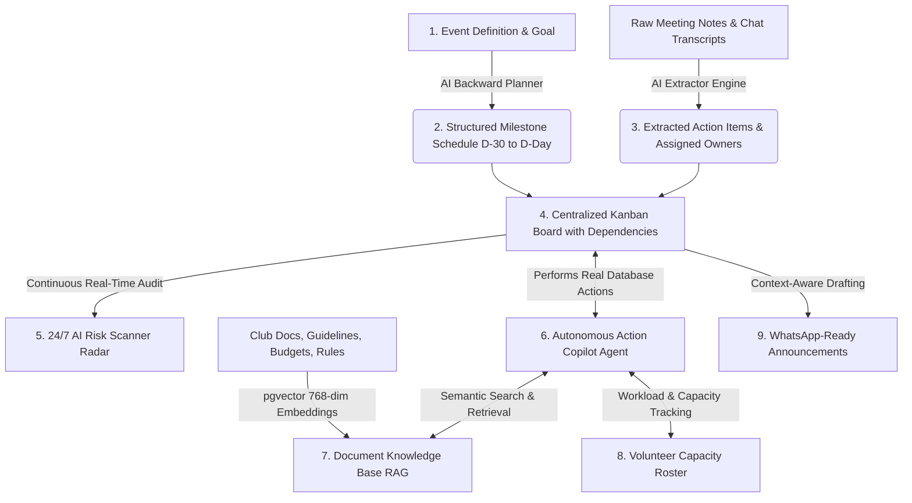

# Convene AI

<div align="center">

### 🎪 Centralized AI-Powered Event Operations Platform for College Clubs
**Official Implementation for Problem Statement: PS-3 — ClubOps AI**

[](https://nextjs.org/)
[](https://react.dev/)
[](https://www.typescriptlang.org/)
[](https://tailwindcss.com/)
[](https://aistudio.google.com/)
[](https://supabase.com/)

</div>

---

## 📌 Problem Statement: PS-3 — ClubOps AI

### 1. Introduction & Background
College clubs and campus organizations frequently manage events using a fragmented web of WhatsApp groups, spreadsheets, shared documents, messy meeting notes, and personal task lists.

As campus events grow larger and involve more stakeholders, managing **responsibilities, deadlines, task dependencies, volunteers, documentation, and potential operational risks** becomes increasingly difficult.

### 2. The Core Challenge
The mandate of **PS-3** is to build a centralized **AI-powered event operations platform** that brings all essential club activities into one unified command center, spanning:
* **Tasks & Dependencies**
* **Volunteers & Workload**
* **Meetings & Notes**
* **Deadlines & Milestones**
* **Documents & Knowledge Repository**
* **Risks & Bottlenecks**
* **Announcements & Communication**
* **Event-Related Institutional Knowledge**

**The Critical AI Requirement:**  
The AI layer must assist the club throughout the entire event lifecycle and, crucially, **perform actual application actions rather than simply generating text**.

---

## 💡 What Convene AI Is Made For

**Convene AI** is the direct realization of **PS-3 — ClubOps AI**. It unifies every disparate aspect of student club event operations into a single real-time platform. 

Instead of forcing organizers to maintain manual spreadsheets or interact with disconnected chat windows, Convene AI embeds an **Autonomous Action Copilot** directly into the event database. The AI understands event context, autonomously schedules deliverables backwards from the event date, parses messy meeting transcripts into assigned tasks with deadlines, monitors volunteer workloads to prevent burnout, surfaces operational risks with plain-English explanations, and searches club knowledge via semantic vector search (RAG).

---

## 🔄 How It Solves the Problem: End-to-End Operational Lifecycle

Convene AI orchestrates club operations through a cohesive, continuous workflow designed for real student organizing teams:



### Operational Workflow Steps:
1. **AI-Assisted Backward Planning:** Organizers specify the event name, concept, and target date. The AI generates a complete milestone schedule working backwards from event day (D-30, D-14, D-7, D-1) with prerequisite dependencies and committee role assignments.
2. **Meeting & Transcript Ingestion:** After every committee meeting or sync, organizers paste unstructured notes, minutes, or transcripts into the platform. The AI extracts deliverables, estimates realistic deadlines, and fuzzy-matches task owners against registered volunteer names and skill sets.
3. **Task Board Execution with Dependencies:** Tasks are tracked on an interactive 3-column Kanban board (`todo`, `doing`, `done`) with explicit dependency links (`depends_on`) that prevent team members from starting blocked work prematurely.
4. **Volunteer Workload & Capacity Balancing:** Organizers monitor real-time capacity meters (% load) for every team member. If a lead is overloaded while other volunteers have bandwidth, tasks can be rebalanced in 1 click.
5. **Continuous Risk Identification & Explanation:** The AI continuously evaluates the event state, flagging overdue deliverables, blocked critical-path dependencies, and overloaded volunteers, providing actionable step-by-step mitigation advice.
6. **Autonomous Copilot Execution:** Committee members command the platform through a floating AI Copilot. The agent doesn't just offer suggestions—it creates tasks, reassigns owners, updates statuses, sets deadlines, and queries knowledge base documents using real database function calls.
7. **Context-Aware Broadcast Communication:** The platform drafts targeted announcements by pulling live upcoming deadlines directly from the database, formatting them with WhatsApp markdown for 1-click broadcast to club members.

---

## 🎯 Deliverables Fulfillment Matrix (PS-3 Specification)

| PS-3 Expected Deliverable | Convene AI Implementation | How It Works |
|---|---|---|
| **AI-Assisted Event Planning** | **Backward Milestone Planner** (`/plan`, `/dashboard`) | Generates structured task plans backwards from the target event date, establishing prerequisite dependency graphs across committee roles. |
| **Task & Volunteer Management** | **Kanban Board & Capacity Roster** (`/tasks`, `/volunteers`) | 3-column Kanban board with priority flags and dependency links (`depends_on`), paired with volunteer workload capacity meters and skill tracking. |
| **Meeting-Note or Transcript Processing** | **Meeting Ingestion Portal** (`/meetings`) | Accepts raw, unstructured meeting minutes, voice-to-text transcripts, or committee chat logs for automated operational analysis. |
| **Automatic Extraction of Action Items** | **AI Extraction Engine** (`/api/meetings/extract`) | Analyzes transcripts to identify key decisions, deliverables, and actionable commitments without requiring manual review. |
| **Automatic Identification of Owners & Deadlines** | **Fuzzy Roster Matcher** (`/api/meetings/extract`) | Matches mentioned responsibilities to volunteer roster members based on names and skills, calculating realistic completion deadlines. |
| **Risk Identification & Explanation** | **24/7 AI Risk Scanner** (`/risks`, `/api/risks/scan`) | Automatically detects overdue tasks, dependency bottlenecks, and overloaded volunteers; Gemini explains operational impact and mitigation steps. |
| **Club Document & Knowledge Repository** | **pgvector RAG Knowledge Base** (`/documents`, `/api/documents`) | Upload event guidelines, rules, budgets, and contracts; chunks and embeds content via 768-dim vectors for semantic search with source citations. |
| **AI-Assisted Announcements & Communication** | **Context-Aware Announcement Drafter** (`/announcements`) | Generates broadcasts pulling real-time upcoming deadlines and volunteer calls-to-action, formatted for WhatsApp with 1-click clipboard dispatch. |
| **AI Workflows Performing Application Actions** | **Autonomous Action Copilot** (`/api/agent`) | Floating copilot with 9 Gemini function-calling tools executing real mutations directly in the PostgreSQL database. |

---

## 🤖 Autonomous Action-Taking AI Copilot (The Core PS-3 Innovation)

The fundamental requirement of **PS-3** is that the AI must **"perform actual application actions rather than simply generating text."** 

Convene AI fulfills this through its server-side Copilot Agent (`app/api/agent/route.ts`), which is equipped with **9 database-modifying tools** powered by Google Gemini function-calling:

```
┌────────────────────────────────────────────────────────────────────────┐
│                        AI Copilot Function Calling                      │
├───────────────────────────────┬────────────────────────────────────────┤
│ Tool Name                     │ Database Action Executed               │
├───────────────────────────────┼────────────────────────────────────────┤
│ create_task                   │ Inserts new task with title, priority, │
│                               │ deadline, and owner into tasks table   │
│ assign_task                   │ Reassigns task to volunteer using      │
│                               │ fuzzy name matching on members table   │
│ update_task_status            │ Moves task between todo, doing, done   │
│ set_deadline                  │ Modifies target completion deadline    │
│ list_tasks                    │ Filters tasks by status/priority/owner │
│ add_volunteer                 │ Registers new member with skills/roles │
│ create_announcement_draft     │ Generates draft in announcements table │
│ run_risk_scan                 │ Audits database for bottlenecks/risks  │
│ search_documents              │ Runs cosine vector similarity query   │
│                               │ across document_chunks (pgvector)      │
└───────────────────────────────┴────────────────────────────────────────┘
```

When an organizer types *"Assign the venue approval task to Sarah and set the deadline to Friday"*, the agent does not reply with advice—it executes `assign_task` and `set_deadline` against the database and reports the confirmation.

---

## 💻 Suggested Technology Stack (PS-3 Section 4 Alignment)

Convene AI implements the recommended PS-3 technology stack with modern, production-grade frameworks:

| Component | PS-3 Recommendation | Convene AI Implementation | Architecture & Role |
|---|---|---|---|
| **AI Models** | Gemini, ChatGPT, Claude, Llama | **Google Gemini (`gemini-3.6-flash` & `gemini-3.5-flash-lite`)** | High-speed reasoning, function-calling tool execution, meeting parsing, and risk assessment with automatic 429 exponential backoff retries. |
| **AI APIs** | Gemini API, OpenAI API | **Google GenAI SDK (`@google/genai`)** | Serverless SDK integration handling structured JSON schemas and function calling. |
| **Frontend** | React / Next.js / Tailwind CSS | **Next.js 16.3.5 (App Router, Turbopack) & React 19** | Full-stack server/client component architecture styled with **Tailwind CSS v4** and animated with **Framer Motion**. |
| **Backend** | Node.js / Python / Java / PHP | **Next.js Serverless Route Handlers (`app/api/*`)** | High-performance TypeScript backend endpoints on Node.js runtime. |
| **Database** | PostgreSQL / MongoDB / SQLite | **Supabase (PostgreSQL with `pgvector`)** | Relational data model for events, members, tasks, meetings, and risks, plus pgvector for semantic embeddings. |
| **RAG & Docs** | RAG, document processing | **`gemini-embedding-001` + pgvector IVFFlat Index** | 768-dimensional vector cosine similarity search for document Q&A and knowledge retrieval. |
| **Additional** | Data visualization, notifications | **Lucide Icons, ThemeContext, Capacity Meters** | Live capacity meters, Dark/Light mode theme engine, and 3D visual canvas powered by **Three.js & React Three Fiber**. |

---

## 📂 Project Architecture

```
convene-ai/
├── app/
│   ├── (app)/                       # Centralized ClubOps Operations Workspace
│   │   ├── dashboard/               # Operational overview & AI backward milestone planner
│   │   ├── tasks/                   # 3-column Kanban board with dependency tracking
│   │   ├── volunteers/              # Volunteer roster & workload capacity tracker
│   │   ├── meetings/                # Meeting notes & action item extractor
│   │   ├── documents/               # Club knowledge base & pgvector RAG semantic search
│   │   ├── announcements/           # Context-aware broadcast draft generator
│   │   └── risks/                   # 24/7 AI Risk Scanner radar
│   ├── api/                         # Backend API Endpoints (PS-3 Workflows)
│   │   ├── agent/                   # Autonomous Action Copilot with Gemini tool-calling
│   │   ├── plan/                    # Backward milestone generator
│   │   ├── meetings/extract/        # Meeting transcript action item parsing engine
│   │   ├── risks/scan/              # Overdue & bottleneck risk detector
│   │   ├── documents/               # Document chunking, embedding, & RAG vector search
│   │   └── announcements/           # Live context announcement generator
│   ├── signin/                      # Direct sign-in & trial dashboard entry
│   ├── account-creation/            # Multi-step club onboarding workflow
│   ├── globals.css                  # Design tokens & Tailwind utility configurations
│   ├── layout.tsx                   # Root HTML layout with ThemeProvider
│   └── page.tsx                     # Interactive showcase landing page
├── components/landing/              # Showcase components, 3D Canvas, Bento feature grid
├── lib/
│   ├── ai.ts                        # Gemini SDK helper with 429 exponential backoff retry
│   ├── chunking.ts                  # Document text chunker for vector embeddings
│   ├── mock-data.ts                 # Local demo dataset fallback
│   ├── supabase/                    # Supabase browser, server, & mock database clients
│   └── utils.ts                     # UI styling class merge utilities
├── supabase/
│   ├── schema.sql                   # Relational database schema with pgvector extension
│   ├── seed.sql                     # Seed data for campus hackathon demo event
│   └── rag.sql                      # Vector search SQL function (match_document_chunks)
└── package.json
```

---

## 📄 License

MIT © [Convene AI Team](https://github.com/jeetptl1503/convene-ai)
